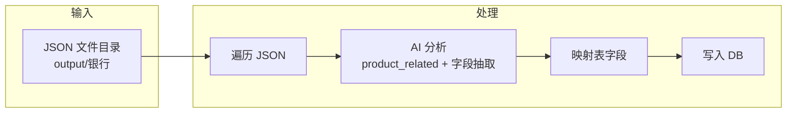
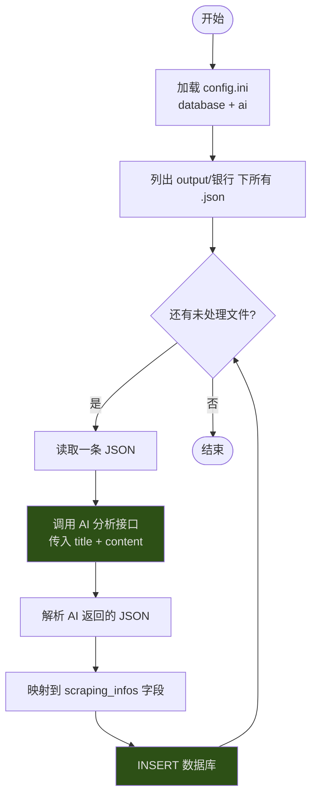

# 爬取信息 AI 分析入库设计

## 一、目标

把 `output/银行` 下爬取的 JSON 通过 AI 分析后，匹配 `scraping_infos` 表字段并入库：

- **product_related**：判断是否与「监管报送」「IT系统建设」「软件相关」「其它科技相关」相关；
- **sub_type**：细分类型，如 招标、中标、流标、公示、征集、磋商、谈判 等；
- 其它字段从正文中抽取后写入对应列。

## 二、原理概览

- **数据流**：目录 → 逐个 JSON → 用大模型对 `title` + `content` 做分类与信息抽取 → 填到与表字段对应的结构 → 插入 `scraping_infos`。
- **product_related 判定**：由 AI 根据标题和正文判断是否涉及监管报送、IT 系统建设、软件、其它科技；可多选，用逗号分隔写入 `product_related`（如 `IT系统建设,软件相关`），无关则空或「非科技」。
- **sub_type**：由 AI 从标题/正文中识别公告类型（招标、中标、流标、公示、征集、磋商、谈判、询价等），写入 `sub_type`。
- **其它字段**：由 AI 从正文中抽取项目编号、预算、中标金额、招标方式、业主、联系人、电话、中标单位、代理、截止时间、发布时间等，与表字段一一对应。

## 三、执行步骤

1. 加载配置：数据库连接、AI API（如 base_url、api_key、model）。
2. 遍历 `output/银行` 下所有 `.json` 文件（可按需过滤已入库，例如用 `detail_url` 去重）。
3. 对每条：读取 `title`、`content`、`url`、`crawl_time` 等。
4. 调用 AI：请求里包含「product_related 分类 + sub_type + 表字段抽取」的 prompt，要求返回固定结构的 JSON。
5. 解析 AI 返回，映射到 `scraping_infos` 各字段（含 `keyword`=银行、`type`=采招信息、`detail_url`=url 等）。
6. 执行 INSERT（若使用 `detail_url` 唯一则改为 REPLACE 或先查再决定 INSERT/UPDATE）。

## 四、表字段与来源对应关系

| 表字段 | 来源说明 |
|--------|----------|
| keyword | 固定或配置，如「银行」 |
| type | 固定「采招信息」或从 JSON info_type |
| sub_type | **AI 识别**：招标/中标/流标/公示/征集/磋商/谈判/询价等 |
| title | JSON title |
| province/city/district | **AI 抽取** 或 从正文/标题解析 |
| detail | JSON content |
| published_at | **AI 抽取** 或 正文中的发布时间 |
| bid_doc_fetched_at | 可选：标书获取时间 |
| project_no | **AI 抽取** 项目编号 |
| project_budget | **AI 抽取** 项目预算 |
| winning_amount | **AI 抽取** 中标金额 |
| bidding_method | **AI 抽取** 招标方式 |
| project_owner | **AI 抽取** 项目业主 |
| owner_contact / owner_phone | **AI 抽取** |
| winning_bidder / winning_bidder_contact / winning_bidder_phone | **AI 抽取** |
| bidding_agent | **AI 抽取** 招标代理 |
| bid_deadline | **AI 抽取** 投标截止时间 |
| detail_url | JSON url |
| **product_related** | **AI 判定**：监管报送 / IT系统建设 / 软件相关 / 其它科技相关（多选用逗号分隔） |

## 五、product_related 取值约定

- **监管报送**：与监管数据报送、报送系统、监管报表等相关。
- **IT系统建设**：机房、网络、系统建设、信息化项目、数据中心等。
- **软件相关**：软件开发、系统开发、软件采购、运维、平台等。
- **其它科技相关**：其它与科技/信息化相关但不好归入以上三类的。

若与以上均无关（如纯物资、物业、餐饮），则 `product_related` 留空或填「非科技」；入库时可按需只入库「与科技相关」的记录。

## 六、暗色主题 Mermaid 说明

图中用 `style` 对关键节点着色，在暗黑主题下可读；若需统一暗色，可在 Mermaid 配置中设置 `theme: dark`。

---

## 七、10 条样例预期结果

以下针对你现有 `output/银行` 中典型标题，给出预期 `sub_type`、`product_related` 及部分抽取字段的预期（规则或 AI 均可达到）。

| # | 标题（缩写） | sub_type | product_related | 部分抽取字段预期 |
|---|--------------|----------|----------------|------------------|
| 1 | 平安银行南京分行26-27年PC维保&IT系统开发项目供应商寻源征集 | 征集 | IT系统建设,软件相关 | project_owner≈平安银行南京分行；bidding_method 可为空或询价 |
| 2 | 中国建设银行天津市分行天津市公安局交通管理局非税系统项目供应商征集公告 | 征集 | IT系统建设,软件相关 | project_owner≈中国建设银行天津市分行；正文有“非税系统” |
| 3 | 青岛银行数据中心数据安全防护提升和老旧网络设备替换所需设备项目采购公告 | 采购 | IT系统建设 | project_budget≈381.66万元；project_no≈集采【2026】13号/0656-2640CY0092；bidding_method≈谈判 |
| 4 | 国家开发银行西藏自治区分行2025年新营业用机房建设项目中标结果公示 | 公示 | IT系统建设 | winning_bidder≈恒华数字科技集团；winning_amount≈4151081.45元；bidding_agent≈国信招标集团；project_no≈GXTC-C-26050030 |
| 5 | 四川银行眉山分行2026年第2期个人客户权益线上兑换项目流标公示 | 流标 | 其它科技相关 或 空 | sub_type=流标；无明确预算/中标金额 |
| 6 | 肇庆新区财政金融局肇庆新区本级财政国库集中支付业务代理银行采购项目中标公告 | 中标 | 非科技（空） | 与科技无关，product_related 为空；winning_bidder 从正文抽 |
| 7 | 河南正阳农村商业银行股份有限公司客户经理外包项目招标公告 | 招标 | 非科技（空） | 人力外包，非 IT/软件；sub_type=招标 |
| 8 | 中国银行股份有限公司鹰潭市分行客户停车位服务采购项目竞争性磋商公告 | 磋商 | 非科技（空） | 停车位服务；sub_type=磋商；bidding_method=竞争性磋商 |
| 9 | 广州农村商业银行同业客户信息数据服务项目供应商征集公告 | 征集 | 软件相关,其它科技相关 | “数据服务”偏向软件/科技；project_owner≈广州农村商业银行 |
| 10 | 中国银行山西省分行集中采购结果公示信息表 | 公示 | 视具体内容（可能多条混合） | 多为汇总表，单条可能无完整项目编号；sub_type=公示 |

说明：

- **sub_type** 以标题优先匹配：中标 > 流标 > 成交结果/候选人公示 > 公示 > 征集 > 磋商 > 谈判 > 询价 > 招标/邀请/采购 > 其他。
- **product_related** 多选用逗号分隔；与科技无关的条目可为空，若配置 `ingest_tech_only=true` 则这些不入库。
- 实际入库字段以正文抽取结果为准，上表仅作“预期方向”参考；启用 AI 后抽取更全、更稳。
